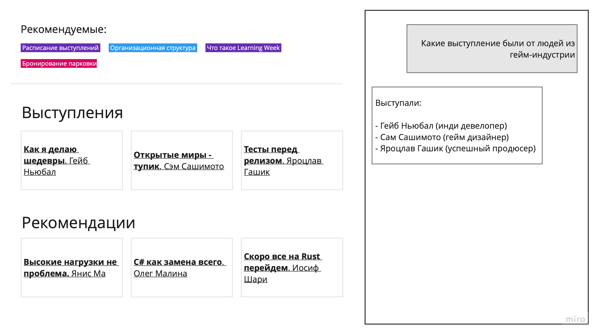
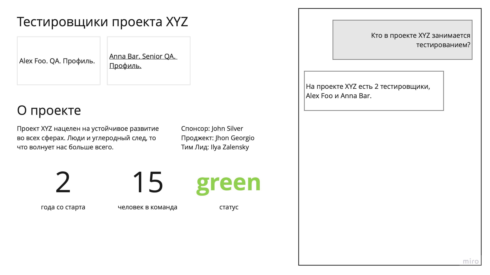

# Интерфейс который генерит LLM

## Концепция
> Прокт гибридного интерфейса Chat/UI, берем лучшее из 2х миров

Пользователь может применять и свой привычный опыт использования интерфейсов (гиперссылки, поиск) и чат одновременно.

Интерфейс разделен на 2 части справа чат слева веб сайт. Пользователь может использовать сайт как обычно. Но если она начинает набирать что-то в чате сайте перестраивается под запрос пользователя.

 

> Что значит перестроиться? Каждый сайт состоит из каких то блоков - заголвоки, анонсы, контент и т.д. Эти блоки собираются в сетку сайта (в контексте верстки). Изменения сетки и ее содержимого и есть перестройка.

Например мы делаем внутренний сайт компании, с базой знаний...

LLM будет знать типы шаблонов под разные случаи. Например, когда надо показать страницу пользователя - один шаблон, страницу с документацией второй, список документов - третий.

Под знаниями компании подразумевается любые данные компании, даже например содержание какой либо базы.

Все знания компании помещаются в векторную базу знаний (embededing). Это поможет в будущем искать документы по контексту. 

Алгоритм действия:
1. Пользователь задает вопросы системе и мы ищем релевантные данные в векторной базе знаний.
2. Далее спрашиваем у LLM какой шаблон верстки подойдет под полученные релевантные данные, и он же заполняет шаблон. Если надо он даже может картинку нарисовать.
3. Полученный интерфейс может уже дать ответы на пользовательские вопросы или дать ссылки на источники.

## Архитектура

## Безопасность данных
Если несколько способов предостеречь от утечки данных:
- Использовать in-house LLM
- Скармливать LLM только анонимизированные данные
- Отдатать в LLM только часть данных нужных для "индексации"
